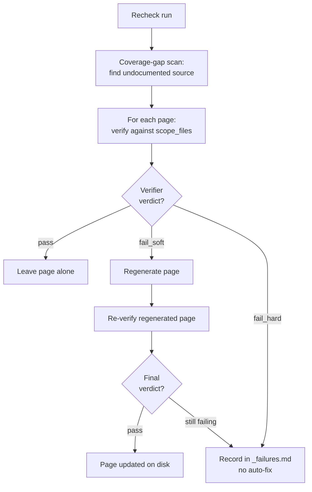

# Wiki System — README

A reusable, AI-driven documentation pipeline for software projects. Generates accurate technical and product documentation from a codebase, verifies every claim against source, and can publish to Notion on demand. This file explains how it works, why it works that way, and the techniques behind it.

This README is the entry point for anyone adopting the system in a new project, debugging a run, or modifying the pipeline itself.

---

## 1. What problem this solves

Two problems, really:

1. **Documentation drifts from code.** Hand-written docs go stale within weeks of a refactor. Auto-generated docs (Swagger, JSDoc, etc.) are accurate but cover only API shape, not architecture or behavior. This system covers the gap: natural-language documentation that describes *behavior, integration, gotchas, flows* — generated from source code and re-verified against source whenever you re-check the wiki.

2. **Different audiences need different documentation.** A backend engineer needs file paths and function names. A product manager needs flows and business rules in plain language. A reusable system that produces both, from the same source, with consistent quality and accuracy guarantees.

The system also explicitly does **not** try to:

- Replace specifications, design documents, or product briefs (those go in `wiki/notes/`, hand-written).
- Generate decision rationale or architectural-decision records. Source code captures decisions implicitly; the system trusts that AI-over-MCP can synthesize architectural assessment from the existing reference docs + code without pre-baked ADRs.
- Produce tutorials or onboarding guides. Those are hand-written if needed.

---

## 2. Core philosophy

Five principles, in priority order. Every design choice in the pipeline can be traced back to one of these.

### P1 — Source code is the source of truth

Every claim in auto-generated documentation must be verifiable against the source code at HEAD. Writers read source files; verifiers re-read source files; both produce structured records of which file:line supports which claim. The pipeline never trusts "the model probably knows" or "we said so last time" — every regen re-reads source.

This is why the verifier exists as a separate agent from the writer: the writer's job is to produce prose; the verifier's job is to confront the prose with reality. The conflict of interest at the boundary is the value.

### P2 — Two content modes, one pipeline

The wiki has exactly two content modes:

- **Library** (`wiki/library/`) — describes current state of the code and product. Auto-regenerated. Authoritative for "what does the system do."
- **Notes** (`wiki/notes/`) — plans, ideas, RFCs, research, roadmaps. Hand-written, mutable. Treat as intent or speculation.

Writers (technical, product) only produce content under `wiki/library/`. The pipeline never touches `wiki/notes/` — that's hand-written.

The wiki root files (`wiki/OVERVIEW.md`, `wiki/topics.md`) are a third special case: they are **synthesized by the orchestrator's finalize phase** from the now-complete reference tree, after all writers and verifiers finish. They are not planned as writer pages — they're derived artifacts. Hand-edit zone markers (`<!-- AUTOREGEN_SKIP_BEGIN/END -->`) let projects override sections of either file with hand-written content that survives across runs.

### P3 — The plan is the coordination spec

A YAML file at `wiki/.internal/plan.yaml` defines what pages exist, what files each documents, who writes each, and how they cross-link. The orchestrator produces it once; writers and verifiers consume it. The plan is a structured artifact, not free-form prose, so:

- Sub-agents parse the same spec the orchestrator produced — no drift between intent and execution.
- A writer can request structural changes (`split_request`) that the orchestrator accepts by editing the plan, without re-planning the whole wiki.
- A run interrupted mid-flight can resume from `wiki/.internal/plan.yaml` + the on-disk wiki state. No in-memory state is load-bearing.
- Quality gates and link checks run against the plan, not against a mental model.

The full plan schema lives in `spec/plan-schema.md`.

### P4 — Verifier is the only quality gate

There is no human-confirm step. The verifier's verdict directly controls what happens to a page:

- `pass` → page is accepted as-is.
- `fail_soft` → orchestrator auto-fixes once. If still fails, escalate to `fail_hard`.
- `fail_hard` → page is **flagged, not auto-fixed**. It is recorded in `_failures.md` for human review; the existing content stays.

This puts real weight on verifier calibration. A lax verifier means bad content survives unflagged. A strict verifier means false-positive `fail_hard` verdicts block legitimate updates. Severity must be honest.

The trade-off here is deliberate: human confirm steps don't scale and tend to become rubber-stamps. A well-calibrated automated verifier produces more reliable docs over time than a checkbox-driven human review.

### P5 — Verify cheaply, regenerate only what fails

A re-check should never blindly regenerate the whole wiki. The pipeline:

- Verifies pages against their `scope_files` first — cheap, read-only.
- Regenerates only the pages whose verification fails.
- In Maintenance mode, uses `git diff` against the last generation to mark pages whose source is unchanged `state: unchanged`, skipping them entirely.

The result: a recheck of an up-to-date wiki produces mostly `pass` verdicts and few or no regens. Verification is much cheaper than generation, so verifying broadly while regenerating narrowly is what keeps re-checks affordable.

---

## 3. The wiki shape

```
wiki/
├── OVERVIEW.md                ← orchestrator-generated in Phase 3e finalize
├── topics.md                  ← orchestrator-generated in Phase 3e finalize
│
├── .internal/                 ← skill-internal artifacts (plan, verification, traces, Notion mapping)
│   ├── plan.yaml              ← coordination spec, written by orchestrator
│   ├── plan-surface.md        ← surface enumeration (Phase 1)
│   ├── link-report.md         ← link-graph check output
│   ├── notion-sync.yaml       ← disk↔Notion mapping (a cache; notion init/sync/recheck)
│   ├── notion-sync-report.md  ← last notion sync report
│   ├── notion-recheck-report.md ← last notion recheck (audit-vs-code) report
│   ├── notion-recheck/        ← scratch: <page-id>.fetched.md (live Notion content under audit)
│   ├── verification/          ← per-page YAML reports from verifier
│   │   ├── <page-id>.yaml     ← local recheck/init verdict
│   │   ├── <page-id>.notion.yaml ← notion recheck verdict (Notion content vs code)
│   │   └── _failures.md       ← summary of fail_hard verdicts
│   └── trace/                 ← per-run decisions log
│       └── decisions.md
│
├── library/                 ← AUTO-GEN by writers. Verified claim-by-claim.
│   ├── OVERVIEW.md
│   ├── <repo-a>/              ← one folder per repo or top-level area
│   │   ├── OVERVIEW.md
│   │   ├── architecture.md
│   │   └── ...
│   ├── <repo-b>/
│   │   └── ...
│   └── product/               ← if the project has a product surface
│       ├── OVERVIEW.md
│       └── ...
│
└── notes/                   ← HAND-WRITTEN. Out of scope. Plans, ideas, RFCs.
    ├── _template.md
    └── <yyyy-mm-slug>.md
```

Operational rules:

| Surface                                        | Produced by                       | Verifier?               | Publish?                              | Mutability                                  |
| ---------------------------------------------- | --------------------------------- | ----------------------- | ------------------------------------- | ------------------------------------------- |
| `wiki/OVERVIEW.md`, `wiki/topics.md`           | Orchestrator (Phase 3e finalize)  | None                    | Via `notion sync` (OVERVIEW→root body; topics→`Topics` page) | Auto-rewritten; hand-edit zones survive     |
| `wiki/library/**/*.md`                       | Technical / product writer (3b/3c)| Strict (claim-by-claim) | Via `notion sync`                     | Auto-rewritten; hand-edit zones survive     |
| `wiki/notes/**/*.md`                         | Hand-written                      | None                    | Not published (`notion sync` makes a human-owned `Notes` placeholder instead) | Free-form |
| `CLAUDE.md`                                    | `claude` / `notion claude` (`claude-md.md`) | None          | Not published (it can *link* to the Notion pages via `notion claude`) | Written only on explicit request; hand-edit zones survive |

The orchestrator's finalize phase produces two derived artifacts: `wiki/OVERVIEW.md` and `wiki/topics.md`. Both are synthesized from the on-disk reference tree and `wiki/.internal/plan.yaml`, not from `scope_files`. They are NOT writer pages and do not appear in `wiki/.internal/plan.yaml`. Hand-edit zone markers let projects override any auto-generated section with content that survives across runs. **`CLAUDE.md` is not a finalize artifact** — it is owned by the separate `/wiki-system claude` command (`claude-md.md`), which is the only command that writes it; `init`/`recheck` merely suggest running it. This keeps documentation an on-request act.

---

## 4. The pipeline

The orchestrator runs two flows: a full **bootstrap** (`init`) and an incremental **recheck**. Recheck is the steady-state loop — verify what exists, regenerate only what drifted:



Publishing to Notion is a separate, on-demand step (`notion sync`, §8) — not part of this flow.

### Phases (orchestrator-internal, used for full-regen runs)

When the orchestrator runs a full generation (initial bootstrap, or a forced full-regen), it executes five sub-phases:

| Phase | Purpose                                                                                          |
| ----- | ------------------------------------------------------------------------------------------------ |
| 1. Scan      | Dispatch one scan sub-agent per repo (in parallel); each returns a condensed structured summary + its surface table. The orchestrator synthesizes a cross-repo integration map from the summaries — raw source never enters its context. |
| 2. Plan      | Produce `wiki/.internal/plan.yaml` per the schema in `spec/plan-schema.md`. Apply the scope-to-depth rule. |
| 3a. Stub-out | Create `*TODO*` stubs for every planned page so cross-links resolve from minute one. |
| 3b–c. Write  | Dispatch writer sub-agents in parallel, one per section. Technical writers and product writers run in the same pool. |
| 3d. Verify   | Dispatch verifier sub-agents in parallel, one per written page. Auto-fix `fail_soft`, log `fail_hard`. |
| 3e. Finalize | Generate `wiki/OVERVIEW.md` and `wiki/topics.md` from the completed reference tree. Run deterministic link/parity/numeric-consistency checks. **Does not write `CLAUDE.md`** — it suggests `/wiki-system claude`. Hand-edit zones in both root files are preserved verbatim. |

For incremental runs (a `recheck`), only steps that apply to drifted or failing pages run. The orchestrator does not re-plan unless `wiki/.internal/plan.yaml` is missing or stale.

---

## 5. The agents

Five specialist prompt files. Each is project-agnostic; configuration goes in `init.md`'s CONFIGURATION block.

| Prompt                  | Role                                                                                                |
| ----------------------- | --------------------------------------------------------------------------------------------------- |
| `init.md`          | Orchestrator. Scans repos, plans the wiki, dispatches writers and verifiers, finalizes the run.     |
| `specialists/technical.md`     | Technical writer. Produces reference pages for engineers — file paths, function names, line citations. |
| `specialists/product.md`       | Product writer. Produces reference pages for non-engineers — flows, business rules, plain language. **Zero code references** rule. |
| `specialists/verifier.md`      | Verifier. Reads a draft page + its scope_files, emits a YAML report per claim. Read-only.           |
| `spec/plan-schema.md`   | Library document for the plan format. Not a prompt — a data schema spec.                          |

### Why split writer vs. verifier

Two reasons:

1. **Conflict of interest.** A writer self-checking is an unreliable check. The writer's incentive is to ship; the verifier's incentive is to find errors. Different agents, different prompts, different prompt-injected priors → more independent assessment. **Caveat:** the writer and verifier are different *prompts* but typically the same underlying *model*, so this is prompt-level independence, not model-level — the verifier can share the writer's blind spots and is somewhat biased toward accepting same-family phrasing (the "self-enhancement" bias in the LLM-as-judge literature). Library-guided grading (re-reading the source) is what carries the weight; the prompt split is a secondary safeguard, not a guarantee.

2. **Cost asymmetry.** Verification is much cheaper than generation (single page + scope files, no synthesis). Running it as a separate, parallel pass means we can verify everything cheaply but only regenerate when needed.

### Why split technical vs. product writers

Vocabulary control. Technical pages cite `file:line`; product pages cannot mention any code identifier. A single writer prompt that tries to do both blurs both. Two prompts with strict, opposite rules produce cleaner output.

---

## 6. Techniques

The interesting design choices that make the system work.

### 6.1 — Plan-driven coordination (vs. agent free-for-all)

Instead of letting writers self-organize ("you take auth, I'll take billing"), the orchestrator produces a YAML plan up front. Writers consume the plan; they do not negotiate with each other.

This makes the system **deterministic given a fixed plan**. Same plan + same source code → same wiki structure. No drift between runs because writers chose different organizing principles.

The trade-off: the orchestrator must be smart enough to plan well. If the plan is wrong, writers can request a `split_request` to add nesting, but cannot freelance broader structural changes.

### 6.2 — Stub-out before writing

Before any writer runs, the orchestrator creates `*TODO*` stub files for every planned page. Three benefits:

1. **Cross-links resolve from minute one.** A writer that wants to link to `../client/auth.md` doesn't have to wait for that page to exist.
2. **The folder structure is materialized on disk** before content is written, so the scope-to-depth rule is enforced structurally, not as an afterthought.
3. **A crash mid-run leaves the plan + stubs + partial bodies intact.** Resumed runs scan for stubs that are still `*TODO*` and only re-dispatch those.

### 6.3 — Verify-first, not regen-first

The naive approach: on every recheck, regenerate every page, then verify. This is expensive and produces a lot of "no semantic change" diffs that train reviewers to ignore wiki changes.

The smarter approach: on a recheck, **verify** each page against the existing docs. If the verifier says the existing doc still holds up, no regen. Only regenerate when drift is detected.

This works because the verifier is much cheaper than the writer. A page that hasn't actually changed in behavior (just refactored in shape) often verifies fine against the existing doc, and skips regen entirely.

### 6.4 — Path-scoped, source-aware re-runs

`wiki/.internal/plan.yaml` records each page's `scope_files` (the source paths it documents). In Maintenance mode the orchestrator compares each page's `scope_files` against what changed since the last generation (`git diff` scoped to those paths) and marks pages whose source is unchanged `state: unchanged`.

The effect: a re-run after a change that touched only frontend components leaves the API pages marked unchanged and skips them; only pages whose source actually moved are re-verified or rewritten. The wiki is never blindly regenerated wholesale.

### 6.5 — Hand-edit zone protocol

Some pages benefit from interleaving auto-generated prose with hand-written content (e.g., a section a human wants to maintain by hand). The system supports this via marker comments:

```markdown
<!-- AUTOREGEN_SKIP_BEGIN -->

This paragraph is hand-written. The writer must preserve it verbatim.
The verifier treats it as authoritative and does not extract claims from it.

<!-- AUTOREGEN_SKIP_END -->
```

Writers preserve content between these markers. Verifiers skip claim extraction inside them. The mechanism is opt-in and rarely needed; most reference pages are fully auto-generated.

### 6.6 — Frontmatter on `notes/` pages

Notes pages carry frontmatter that makes lifecycle observable:

```markdown
---
title: <one-line title>
status: draft           # draft | active | parked | archived | superseded
created: 2026-04-25
updated: 2026-04-25
author: <name>
valid_through: null     # YYYY-MM-DD for time-bound docs; null for evergreen
superseded_by: null     # path to the doc that supersedes this
share: internal         # internal | external — intended to gate external publishing (not yet wired)
---
```

This frontmatter is a convention for whatever renders `notes/`: `status` and `valid_through` can be surfaced at the top of a page, and a page past its `valid_through` flagged as stale. (`notion sync` does not currently publish `notes/` at all — it creates a human-owned `Notes` placeholder instead — so the `share` field is informational until working-page publishing is built.)

This is what prevents working content from rotting invisibly. A 2026-Q2 roadmap doc looks fresh in 2027 unless explicitly marked stale; the `valid_through` field forces the question.

### 6.7 — Numeric-consistency quality gate

A common failure mode of multi-page wikis is numeric drift between pages that cite the same count. One page says "33 endpoints," its sibling says "32 endpoints," because the two writers counted independently and one missed an entry.

The numeric-consistency gate runs after writes complete. It surfaces every "<number> <noun>" pair across the wiki (the noun set is derived from the project's own vocabulary, not a fixed list) and flags pages that cite the same noun with different values. Writers must either reconcile or each independently re-count from source until they agree.

### 6.8 — `split_request` protocol

A writer's deep scan sometimes reveals that a planned page covers more scope than the plan estimated. Instead of producing a bloated page or freelancing structure, the writer returns a `split_request` and writes nothing for that page:

```yaml
split_request:
  parent_page: <page id>
  reason: "<why scope exceeds limits>"
  proposed_structure:
    parent_becomes: overview
    children:
      - id: <new slug>
        path: wiki/library/<slug>.md
        scope_files: [...]
        scope_loc_estimate: <int>
        links_to: [...]
```

The orchestrator validates the request, patches `wiki/.internal/plan.yaml`, stubs the new children, and re-dispatches. Splits can recurse — depth is unbounded.

### 6.9 — Verdict-driven regeneration gate

The verifier's verdict is the only signal that decides a page's fate. The severity tiers are `consideration | improvement | critical` (plus `resolved` for verified claims). Three verdicts:

| Verdict     | Meaning                                                          | Action                                            |
| ----------- | ---------------------------------------------------------------- | ------------------------------------------------- |
| `pass`      | 0 critical AND 0 improvement issues (consideration tolerated)    | Accept the page as-is.                            |
| `fail_soft` | 1–3 improvement issues, 0 critical                               | Auto-fix once via writer re-dispatch. Re-verify.  |
| `fail_hard` | 4+ improvement issues, OR any critical issue                     | Flag in `_failures.md` for human review; don't auto-fix. Existing content stays. |

Honest severity calibration is critical. Severity inflation means real issues escape; deflation means legitimate updates get blocked. The verifier prompt is explicit about calibration ("don't inflate every unverified claim to `critical`; don't deflate a contradicted central claim to `consideration`").

---

## 7. Operating cadence (local, manual)

The skill runs locally from the project root, on demand — nothing runs on a schedule or in the background. You invoke each mode through `/wiki-system` when you need it:

| When | Command | What it does |
| --- | --- | --- |
| Once, to bootstrap | `init` | Full scan → plan → stub → write → verify → finalize. Produces `wiki/`. |
| Periodically (every few weeks, or before a release/demo) | `recheck` | Audits the **local** wiki against current source code: coverage-gap scan, verify-first, regenerate drift, refresh root artifacts. |
| To (re)generate `CLAUDE.md` | `claude` | Synthesizes a lean, on-request `CLAUDE.md` from the wiki/repo. The only command that writes it; `init`/`recheck` just suggest it. |
| First time mirroring to Notion | `notion init [<root-url>]` | Creates the Notion page tree (root body = `OVERVIEW`; `Library` tree; `Topics` page; `Notes` placeholder) and writes the mapping. |
| After local edits, to update the mirror | `notion sync` | One-directional push of local changes to Notion (idempotent; no duplicates). |
| To confirm the published docs are still accurate | `notion recheck` | Audits the **live Notion** content against the source code; regenerates drift from code into both Notion and local; reconciles structure; rebuilds the mapping from Notion if lost. |
| To point `CLAUDE.md` at the Notion pages | `notion claude` | Same as `claude`, but the Documentation section links to the published Notion pages (URLs resolved from the mapping via the MCP). Requires an existing mirror. |

Ground truth for verification is always the source code: `recheck` checks the local files against it, `notion recheck` checks the published Notion pages against it; the push commands (`notion init`/`sync`) verify nothing — they mirror.

The only persistent inputs are `init.md`'s CONFIGURATION block (repos, product description) and — for Notion — the root page captured on the first `notion init`/`sync` (and rebuildable from Notion by `notion recheck` if lost). There is no background automation or env-var configuration. Re-running any mode is safe: `recheck` does not re-plan, and `notion sync` updates in place rather than duplicating pages.

---

## 8. Notion publishing

Publishing is its own skill mode — **Mode 3** (`notion.md`), reached by two verbs:
`/wiki-system notion init [<root-page-url>]` for the first-time publish and
`/wiki-system notion sync` for idempotent updates (both run the same orchestrator;
`init` just asserts a first run). It is a one-directional push: the local `wiki/`
tree on disk is the source of truth; Notion is a render target. It drives Notion
entirely through the **Notion MCP** (`notion-*` tools) — it needs no Notion
integration token. Note: `notion init` initializes the *Notion mirror*, not the
local wiki — it is unrelated to the Mode 1 bootstrap.

Behavior (current implementation) — the mirror lives under a single Notion **root
page** (not a database), shaped like this:

```
[root page]   body = wiki/OVERVIEW.md
 ├── 📁 Library   body = wiki/library/OVERVIEW.md; holds the api/client/product tree
 ├── Notes        human-owned placeholder; created once, never overwritten
 └── Topics         body = wiki/topics.md; the cross-cutting index as its own page (ordered last)
```

- The **root page body** is `wiki/OVERVIEW.md`. Its children are a `Library`
  page, a `Notes` page, and a `Topics` page (`wiki/topics.md` as its own page;
  ordered last — a Notion-MCP parser quirk with em-dash titles, see `notion.md`
  § GOTCHAS).
- **`Library`** mirrors the `wiki/library/` tree: a directory with an
  `OVERVIEW.md` becomes a page whose body is that OVERVIEW and whose children are
  its sub-pages/leaf files; a standalone `.md` becomes a childless page.
- **`Notes`** is a one-time placeholder ("this space is for humans, not AI") for
  editing directly in Notion. It is created once and **never overwritten** on
  re-sync, and it does **not** mirror `wiki/notes/` disk content.
- **Icons only on pages that have children** — so `Library` gets one, `Notes`
  and leaf pages do not.
- **Two-pass** to make cross-links resolve: pass 1 creates every page top-down to
  learn its Notion id; pass 2 rewrites relative markdown links (`../client/auth.md`)
  into Notion page links. External links, source-code paths, and `#fragment`/`#Lnnn`
  anchors are left as-is (anchors dropped to the page; unresolved links logged).
- **Idempotent and resumable** via a persisted mapping at
  `wiki/.internal/notion-sync.yaml` (root page id + `wiki path → Notion id → content
  hash`). Re-runs update only changed pages in place; with no source changes a re-run
  performs zero Notion writes. The schema is `spec/notion-sync-schema.md`.
- **Child-preservation rule:** updating a folder/root page includes references to all
  its current child sub-pages, so a `replace_content` never deletes the hierarchy.
- **No silent destruction:** pages whose source vanished from disk are recorded as
  orphans and surfaced to the user (archive / leave / rename) — never auto-archived.
- Scope: `wiki/OVERVIEW.md` (root body), `wiki/topics.md` (the `Topics` page), and
  the `wiki/library/` tree, plus the `Notes` placeholder. It does **not** mirror
  `wiki/notes/` disk content, and never publishes `wiki/.internal/` (generation
  machinery — plan, verification, traces — stays local).

**`notion recheck`** (`notion-recheck.md`) is the audit companion, and the Notion
analog of local `recheck`. Where `init`/`sync` push disk → Notion trusting local
hashes, `recheck` **fetches the live Notion content and verifies it against the
source code** — the same ground truth local `recheck` uses, just applied to the
published copy of the prose rather than the local file. Pages whose published
content drifted from the code (the code changed, a human edited Notion, or stale
local was synced) are **regenerated from code and corrected in both Notion and
local**, so the source and the mirror stay code-accurate and the fix survives the
next sync. It reuses the verifier and writer specialists for this. A
`notion_content_hash` baseline (Notion's own serialization) plus a `git diff` on
`scope_files` let it skip pages that can't have drifted. It also reconciles
structure (missing / orphan / moved / renamed; `Notes` untouched) and —
because Notion's tree mirrors disk — **rebuilds the mapping from Notion's own
structure** when `notion-sync.yaml` is missing or stale. The mapping is therefore
a cache, not a single point of failure; the only state not recoverable from disk +
Notion is the root page id.

### Not yet built (roadmap)

The richer publishing model originally sketched here is deliberately deferred. If/when
it lands, it would layer onto the same mapping:

- **Database mode** with auto-populated properties (Mode, Audience, Status, Last
  verified, Valid through, Share) instead of a plain page tree.
- **Verifier-verdict gating** — skip syncing any page whose latest
  `wiki/.internal/verification/<page-id>.yaml` is `fail_hard`, leaving the previously
  published content in place.
- **`notes/` publishing** gated on `share: external` frontmatter.
- An **"auto-generated, edits will be overwritten" banner** plus a Notion-side
  permission lock to discourage direct edits.

None of these are active in `notion sync` v1 — it publishes the `wiki/library/`
tree as-is.

---

## 9. Failure modes (what to watch for)

The system has known failure modes. Each has a mitigation, but the operator should know to look for them.

| Failure mode                                                  | Mitigation                                                                                                          |
| ------------------------------------------------------------- | ------------------------------------------------------------------------------------------------------------------- |
| Verifier passes accidentally (LLM misses a real claim)        | The verifier is itself an LLM. Cross-page consistency gates (numeric, parity) catch some leakage. The suspect-pass check (`resolved: 0` on an M+ page → re-verify) catches shallow audits. Manual audit periodically. |
| Self-enhancement bias (verifier shares the writer's base model, accepts its blind spots) | Independence is prompt-level, not model-level. Library-guided grading (re-reading source) is the real safeguard. For high-stakes pages, a second verifier — ideally a different model — can be run by hand; not automated by default. |
| `fail_hard` ignored                                           | `_failures.md` is always written; review it after each recheck. Entries that linger across runs signal real problems to fix by hand. |
| Regen produces no semantic change (rephrase only)             | Verify-first avoids most of this — a page that didn't change verifies `pass` and is skipped. If re-checks keep rewriting unchanged pages, tighten `state: unchanged`. |
| Prompt drift (model behavior shifts after provider release)   | Version the prompt files. Force a full `init` + manual review on a prompt-version bump.                             |
| Notion direct edits (someone edits a synced page)             | Overwritten on the next `notion sync`. The `Notes` page is the human-owned exception — it is never overwritten.   |
| Notes/ doc rot (stale roadmap looks fresh)                  | `valid_through` frontmatter; a renderer can flag pages past the date as stale.                                      |
| Plan stale (writers point at files that have been renamed)    | Scope-file existence check at plan time. Verifier re-checks at every run.                                           |
| Cost runaway (large recheck)                                  | Verify-first keeps cost down — verification is cheap and only failures regenerate. Run `recheck` with `verify_breadth: by_complexity` to bound it further. |

The general principle: **observable rot beats silent rot**. The system invests in making problems visible (`_failures.md` is always written, coverage gaps are surfaced for review, stale working pages are flagged) rather than trying to make them impossible.

---

## 10. Adopting the system in a new project

Six steps.

1. Copy the skill's prompt files (`init.md`, `recheck.md`, `claude-md.md`, `notion.md`, `specialists/`, `spec/`) into the project's `.claude/skills/wiki-system/` (or wherever Claude Code loads skills).
2. Edit `init.md`'s CONFIGURATION block with the project's repo names, paths, and product description.
3. Run `/wiki-system init` once. It scans, plans, writes, and verifies, then in finalize produces `wiki/OVERVIEW.md` and `wiki/topics.md`. Then run `/wiki-system claude` to generate `CLAUDE.md` from it.
4. Hand-write `wiki/notes/_template.md` (or copy from the reusable template) for plans, ideas, and RFCs.
5. Optionally hand-edit any auto-generated artifact, wrapping permanent edits in `<!-- AUTOREGEN_SKIP_BEGIN -->` / `<!-- AUTOREGEN_SKIP_END -->` markers so future runs preserve them.
6. To publish: connect the Notion MCP, run `/wiki-system notion init <root-page-url>` once, then `/wiki-system notion sync` to push later updates (§8).

`wiki/` lives in git. Re-run `/wiki-system recheck` periodically to keep it aligned with the code, and `/wiki-system notion sync` to re-publish.

---

## 11. What this system is not

For clarity, three things this system explicitly does **not** do:

- **No ADR / decision-record track.** Source code captures decisions implicitly. AI-over-MCP can synthesize architectural assessment from reference docs + code on demand. Pre-baking decisions into ADRs is redundant and expensive to maintain.
- **No human-confirm step.** The verifier is the only gate — it decides accept vs. regenerate vs. flag. This is a deliberate choice — human gates don't scale and tend to become rubber-stamps. A well-calibrated automated verifier produces more reliable output over time.
- **No tutorials, onboarding guides, or how-to content.** The system documents *what is*, not *how to do X*. If onboarding content is needed, write it by hand in `wiki/` (outside the auto-gen scope) or in a separate docs surface.

If the project needs any of these, add them by hand outside the pipeline — don't try to bend the pipeline to produce them.

---

## 12. File map

| File                     | Role                                                                  |
| ------------------------ | --------------------------------------------------------------------- |
| `README.md`         | This file. System explainer.                                          |
| `SKILL.md`          | Skill entry point. Pre-flight, invocation routing across the four modes. |
| `VERSION`           | Single integer — the canonical skill version (read at run start; bump on material prompt changes). |
| `init.md`           | Bootstrap orchestrator prompt. Scans, plans, dispatches, finalizes.   |
| `recheck.md`        | Recheck orchestrator prompt. Audits existing wiki against source.     |
| `claude-md.md`      | `CLAUDE.md` orchestrator. `/wiki-system claude` (local links) and `/wiki-system notion claude` (Notion-page links, resolved from the mapping). The only prompt that writes `CLAUDE.md`. |
| `notion.md`         | Notion publish orchestrator. `notion init` / `notion sync`: push disk → Notion over MCP. |
| `notion-recheck.md` | Notion audit orchestrator. `notion recheck`: verify live Notion content against the source code, regenerate drift from code into both Notion and local, reconcile structure, rebuild the mapping from Notion. |
| `specialists/technical.md`      | Technical writer prompt.                                              |
| `specialists/product.md`        | Product writer prompt.                                                |
| `specialists/verifier.md`       | Verifier prompt.                                                      |
| `spec/plan-schema.md`    | Library: `wiki/.internal/plan.yaml` schema.                         |
| `spec/notion-sync-schema.md` | Library: `wiki/.internal/notion-sync.yaml` (Notion mapping) schema. |
| `wiki/.internal/plan.yaml`        | Per-project: the coordination spec produced by the orchestrator.      |
| `wiki/.internal/notion-sync.yaml` | Per-project: the disk↔Notion mapping (a cache) maintained by `notion sync` / `notion recheck`; rebuildable from Notion. |
| `wiki/.internal/verification/`    | Per-run: verifier YAML reports (`<id>.yaml` from local recheck/init; `<id>.notion.yaml` from notion recheck) + `_failures.md`. |
| `wiki/.internal/notion-sync-report.md` / `notion-recheck-report.md` | Per-run: the last `notion sync` / `notion recheck` run reports. |
| `wiki/.internal/notion-recheck/`  | Per-run scratch: fetched live Notion content under audit (`<id>.fetched.md`). |
| `wiki/.internal/trace/`           | Per-run: orchestrator decisions log.                                  |
| `wiki/.internal/link-report.md`   | Per-run: link-graph check output.                                     |
| `wiki/OVERVIEW.md`       | Wiki entry point. Generated by the orchestrator's finalize phase.     |
| `wiki/topics.md`         | Cross-cutting topic index. Generated by the orchestrator's finalize phase. |
| `wiki/library/`        | Auto-generated reference content. The pipeline's only write target.   |
| `wiki/notes/`          | Hand-written plans, ideas, RFCs, research.                            |

For details on any specific surface: read the corresponding prompt file or schema reference. Each is self-contained.
