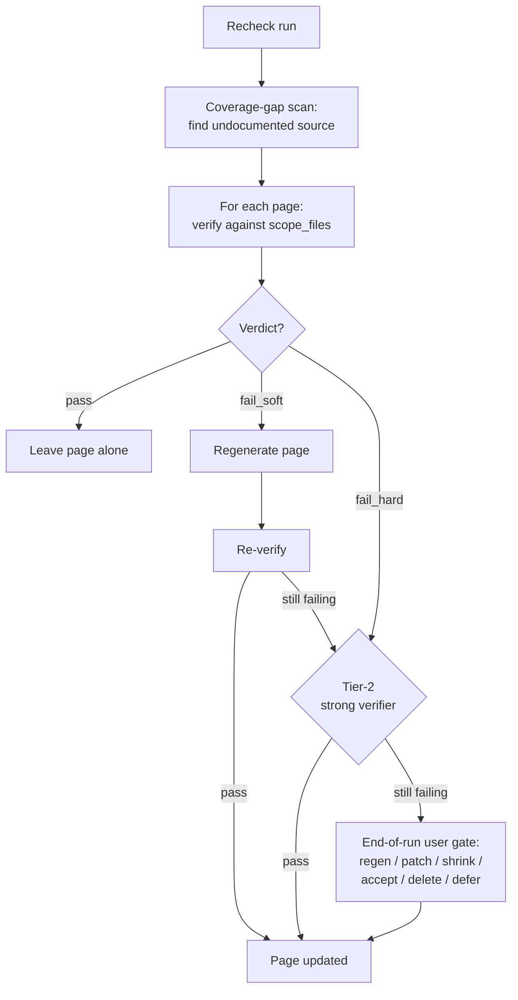

# Wiki System

A Claude Code skill that generates and maintains structured codebase documentation. It reads a project's source, plans a multi-page wiki, dispatches writer and verifier sub-agents, and produces a `wiki/` folder — every claim checked against the source it documents. It can also mirror the result to Notion.

This README explains how the system works and why it's built this way. `SKILL.md` is the operational entry point (modes, routing, pre-flight); read that to run it.

---

## What it solves

- **Docs drift from code.** Hand-written docs go stale; auto-generated docs (Swagger, JSDoc) only cover API shape, not behavior, integration, or gotchas. This system writes natural-language docs from source and re-verifies them against source on every recheck.
- **Different readers need different docs.** AI agents want self-contained, source-anchored invariants/contracts/runbooks loaded on demand; engineers want file paths and function names; product people want flows and rules in plain language. The pipeline produces up to three tracks (`ai` and `product` by default, plus opt-in `technical`) from the same source, with the same accuracy guarantee.

It does **not** produce ADRs, design docs, tutorials, or onboarding guides. Those are hand-written and live in `wiki/notes/`, outside the pipeline.

---

## Core ideas

1. **Source code is the source of truth.** Every auto-generated claim must be verifiable against source at HEAD. Writers read source; verifiers re-read it. Nothing is trusted because "the model knows" or "we said so last time."
2. **Two content modes.** `wiki/library/` is auto-generated and authoritative for "what the system does." `wiki/notes/` is hand-written intent — plans, RFCs, research — and the pipeline never touches it.
3. **The plan is the coordination spec.** `wiki/.internal/plan.yaml` defines every page, its source files, its writer, and its links. The orchestrator writes it once; writers and verifiers consume it. A run interrupted mid-flight resumes from the plan plus on-disk state.
4. **The verifier is the only quality gate.** No human-confirm step. The verifier's verdict decides a page's fate: accept, auto-fix, or flag for human review.
5. **Verify cheaply, regenerate only what fails.** A recheck verifies pages (cheap, read-only) and regenerates only those that drift. With `git diff`, pages whose source is unchanged are skipped entirely.

---

## The wiki shape

```
wiki/
├── index.md                ← orchestrator-generated (finalize phase)
│
├── .internal/                 ← skill artifacts: plan, verification, traces, Notion mapping
│   ├── plan.yaml              ← coordination spec
│   ├── verification/          ← per-page verifier reports + _failures.md
│   ├── notion-sync.yaml       ← disk↔Notion mapping (a cache)
│   └── trace/decisions.md     ← per-run decisions log
│
├── library/                   ← AUTO-GENERATED by writers, verified claim-by-claim
│   ├── index.md               ← library overview (links the enabled tracks)
│   ├── ai/                    ← AI track (DEFAULT ON) — agent-optimized, standalone-complete
│   │   ├── index.md           ← navigable machine index (the agent's front door)
│   │   ├── invariants.md  glossary.md
│   │   └── contracts/  runbooks/  map/  reference/
│   ├── technical/             ← technical track (opt-in) — one folder per repo (ALWAYS nested here)
│   │   ├── index.md
│   │   └── <repo>/            ← one folder per repo, even for a single-repo project
│   │       ├── index.md
│   │       └── ...
│   └── product/               ← product track (DEFAULT ON) — feature-scoped
│
└── notes/                     ← HAND-WRITTEN. Plans, ideas, RFCs. Out of pipeline scope.
```

| Surface | Produced by | Verified? | Mutability |
| --- | --- | --- | --- |
| `wiki/index.md` | Orchestrator (finalize) | No | Auto-rewritten; hand-edit zones survive |
| `wiki/library/**` | AI / technical / product writer | Yes (claim-by-claim) | Auto-rewritten; hand-edit zones survive |
| `wiki/notes/**` | Hand-written | No | Free-form |
| `CLAUDE.md` | `claude` mode only | No | Written only on explicit request |

`wiki/index.md` is derived in the finalize phase from the completed reference tree — it is not a writer page and does not appear in `plan.yaml`. `CLAUDE.md` is written **only** by the `claude` mode; `init`/`recheck` just suggest running it. Hand-edit zones (`<!-- AUTOREGEN_SKIP_BEGIN/END -->`) let projects keep hand-written sections through re-runs.

---

## The pipeline

Two flows: a full **bootstrap** (`init`) and an incremental **recheck**. Recheck is the steady state — verify what exists, regenerate only what drifted:



A full generation (`init`, or a forced full rebuild) runs up to six sub-phases (3d.5 fires only when Phase 3d produced any `fail_hard` pages):

| Phase | Purpose |
| --- | --- |
| 1. Scan | One scan sub-agent per repo (parallel); each returns a condensed summary. The orchestrator synthesizes a cross-repo integration map — raw source never enters its context. |
| 2. Plan | Write `plan.yaml` per `spec/plan-schema.md`. |
| 3a. Stub | Create `*TODO*` stubs for every planned page so cross-links resolve immediately. |
| 3b–c. Write | Dispatch writer sub-agents in parallel, one per section. |
| 3d. Verify | Dispatch verifier sub-agents in parallel. Auto-fix `fail_soft`; escalate via tier-2 strong verifier; queue surviving `fail_hard` pages for the user gate. |
| 3d.5. User gate | If any pages reached `fail_hard`, halt for a batched user-resolution checkpoint (regen / patch / shrink / accept / delete / defer). Skipped if the queue is empty. |
| 3e. Finalize | Generate `index.md`; run link / parity / numeric-consistency checks. Preserve hand-edit zones. |

A recheck does not re-plan unless `plan.yaml` is missing or stale — it only runs the steps that apply to drifted or failing pages.

---

## Commands

Seven invocations across four modes. Ground truth for verification is always the **source code**.

| Command | What it does |
| --- | --- |
| `/wiki-system init` | Bootstrap the local wiki from scratch: scan → plan → stub → write → verify → finalize. |
| `/wiki-system recheck` | Audit the local wiki against current code: coverage-gap scan, verify-first, regenerate drift. Does not re-plan. |
| `/wiki-system claude` | Create/update a lean (≤200-line) `CLAUDE.md` from the wiki/repo. The only command that writes it. |
| `/wiki-system notion init [<url>]` | Bootstrap the docs **directly in Notion from code — no local wiki**: scan → plan → generate (in-memory) → verify → push, then synthesize the overviews in-memory. Never writes `wiki/library/` or `wiki/index.md`; seeds the code anchor into the mapping. Needs the Notion MCP. |
| `/wiki-system notion sync [<url>]` | Publish to Notion — first time *and* every update (one verb). No mapping: create the mirror under the supplied root page + write the mapping. Mapping present: idempotent push of changed pages, in place (no duplicates); also seeds each page's `scope_files`/`owner_agent` code anchor into the mapping. Needs the Notion MCP. |
| `/wiki-system notion recheck` | Audit the live Notion content against the code and fix drift **in Notion only — no local wiki required** (never reads/writes `wiki/library/` or `wiki/index.md`; `scope_files` come from the mapping's seeded anchor or `plan.yaml`); reconcile structure. |
| `/wiki-system notion claude` | Same as `claude`, but the Documentation section links to the published Notion pages. |

Mental model: `init`/`recheck` create and audit the local wiki; `claude`/`notion claude` regenerate `CLAUDE.md`; `notion sync` pushes local → Notion (first publish + updates); `notion recheck` audits Notion against code.

---

## The prompt files

Each is project-agnostic; per-project configuration lives in `init.md`'s CONFIGURATION block.

| File | Role |
| --- | --- |
| `init.md` | Bootstrap orchestrator: scans, plans, dispatches writers and verifiers, finalizes. |
| `recheck.md` | Recheck orchestrator: audits the existing wiki against source. |
| `claude-md.md` | `CLAUDE.md` orchestrator (`claude` and `notion claude`). |
| `notion-init.md` | Notion-native bootstrap orchestrator (`notion init`) — builds the docs into Notion from code, no local wiki. |
| `notion.md` | Notion publish orchestrator (`notion sync` — push an existing local `wiki/`). |
| `notion-recheck.md` | Notion audit orchestrator (`notion recheck`) — verify Notion vs code, no local wiki. |
| `specialists/ai.md` | AI-track writer (default track) — agent-optimized, code-grounded: self-contained, atomic source-anchored claims, invariants + contracts + runbooks + flow map + concise per-area reference + a machine index. |
| `specialists/technical.md` | Technical writer — reference pages with file paths, function names, line citations. |
| `specialists/product.md` | Product writer — flows and business rules in plain language, zero code references. |
| `specialists/verifier.md` | Verifier — reads a draft + its scope files, emits a per-claim YAML report. Read-only. Modes: `ai` / `technical` / `product`. |
| `spec/plan-schema.md`, `spec/notion-sync-schema.md` | Schema references for the two `.internal` YAML artifacts. |

**Why writer and verifier are split.** A writer self-checking is an unreliable check — its incentive is to ship. A separate verifier prompt confronts the prose with source. The independence is prompt-level, not model-level (usually the same underlying model), so the real safeguard is re-reading the source; the prompt split is a secondary one.

**Why the writer tracks are split.** Audience and vocabulary control. The `ai` track is written for an agent retrieving fragments on demand (self-contained, atomic, source-anchored, task/contract-oriented); technical pages are human narrative that cite `file:line`; product pages may not mention any code identifier. Three specialists with distinct rules produce cleaner, non-overlapping output than one prompt trying to do all three — and overlap is actively harmful (duplicated/near-duplicate content is retrieved as conflicting "distractor" context), so the `ai` track links to the others rather than restating them.

---

## Key techniques

- **Plan-driven coordination.** Writers consume a fixed plan instead of self-organizing, so the same plan + same source yields the same structure. A writer that finds a page's scope too large returns a `split_request`; the orchestrator patches the plan and re-dispatches rather than letting writers freelance structure.
- **Stub-out before writing.** `*TODO*` stubs for every page are created up front, so cross-links resolve from the start, the folder structure is materialized on disk, and a crashed run can resume by re-dispatching only the remaining stubs.
- **Verify-first, not regen-first.** On recheck, each page is verified against existing docs; only drift triggers regeneration. Verification is far cheaper than writing, so a refactor that didn't change behavior usually verifies `pass` and is skipped.
- **Source-aware re-runs.** `plan.yaml` records each page's `scope_files`. A `git diff` scoped to those paths marks unchanged pages `state: unchanged` and skips them — a frontend-only change never re-touches the API pages.
- **Numeric-consistency gate.** After writes, every "`<number> <noun>`" pair is surfaced across the wiki and mismatches flagged (one page says "33 endpoints," its sibling says "32"). Writers reconcile by re-counting from source.
- **Hand-edit zones.** `<!-- AUTOREGEN_SKIP_BEGIN/END -->` markers fence hand-written content that writers preserve verbatim and verifiers ignore. Opt-in and rarely needed.

### Verdicts

The verifier emits one of three verdicts, driven by per-claim severity (`consideration` < `improvement` < `critical`):

| Verdict | Trigger | Action |
| --- | --- | --- |
| `pass` | 0 critical and 0 improvement (consideration tolerated) | Accept as-is. |
| `fail_soft` | 1–3 improvement, 0 critical | Auto-fix once, then re-verify. |
| `fail_hard` | 4+ improvement, or any critical | Tier-2 strong-verifier rescue attempt (if configured); surviving failures enter the end-of-run user resolution gate. Run does not complete until every queued page is triaged. |

Honest calibration matters: inflated severity blocks legitimate updates; deflated severity lets real errors through. The verifier prompt is explicit about this.

---

## Notion publishing

Publishing (`notion sync`) is a one-directional push — local `wiki/` is the source of truth, Notion is a render target — driven entirely through the **Notion MCP** (no integration token). (The audit companion `notion recheck`, below, flips this: it treats the **code** as truth and can correct Notion with no local wiki.) The mirror lives under a single root page:

```
[root page]   body = wiki/index.md
 ├── 📁 Library   body = wiki/library/index.md; mirrors the library/ tree
 └── Notes        human-owned placeholder; created once, never overwritten
```

- A `wiki/library/` folder with an `index.md` becomes a page with children; a standalone `.md` becomes a childless page. Icons go only on pages that have children.
- **Two-pass** so cross-links resolve: pass 1 creates pages to learn their Notion ids; pass 2 rewrites relative markdown links into Notion page links.
- **Idempotent and resumable** via the mapping in `wiki/.internal/notion-sync.yaml` (root id + `path → Notion id → content hash`). With no source changes, a re-run performs zero writes.
- **No silent destruction.** A page whose source vanished is surfaced as an orphan for the user to resolve — never auto-archived. `Notes` is never overwritten.
- It does **not** publish `wiki/notes/` content or anything under `wiki/.internal/`.

`notion init` is the build-counterpart of `sync` for teams whose doc home is Notion: it stands up the whole mirror **from code in one pass — scan → plan → generate (in-memory) → verify → push** — and **needs no local wiki**. It reuses the same create/render/push machinery as `notion sync`, but generates and verifies each page from source instead of reading it off disk, and writes only `wiki/.internal/` (the plan + the mapping with its seeded code anchor), never `wiki/library/` or `wiki/index.md`.

`notion recheck` is the audit companion: it fetches the live Notion content and verifies it against the source code (the same ground truth as local `recheck`) — **without a local wiki**. It never reads or writes `wiki/library/` or `wiki/index.md`; each page's `scope_files` come from the mapping's seeded code anchor (or `plan.yaml` if present), and drifted pages are regenerated from code and fixed **in Notion only**. Structure is reconciled, and the mapping is rebuilt from Notion's own tree if `notion-sync.yaml` is lost — so the mapping is a cache, not a single point of failure. (Because fixes land only in Notion, a later `notion sync` from a stale local checkout could overwrite them — the recheck report flags this and points to `recheck` + `notion sync` to converge.)

---

## Failure modes

| Failure mode | Mitigation |
| --- | --- |
| Verifier passes a real error (it's an LLM) | Cross-page consistency gates catch some leakage; the suspect-pass check (`resolved: 0` on a large page → re-verify) catches shallow audits; audit by hand periodically. |
| Verifier shares the writer's blind spots (same base model) | Re-reading source carries the weight, not the prompt split. For high-stakes pages, run a second verifier by hand. |
| `fail_hard` accumulating silently | Eliminated by design: the run does not complete until every `fail_hard` page from this run has a recorded resolution (regen / patch / shrink / accept / delete / defer). `defer` is an explicit dated choice surfaced again on the next run, not a silent skip. |
| Regen produces only rephrasing | Verify-first skips pages that didn't change. If unchanged pages keep getting rewritten, tighten `state: unchanged`. |
| Prompt drift after a model release | Version the prompts (`VERSION`); force a full `init` and review on a version bump. |
| Notion direct edits | Overwritten on the next `notion sync`. `Notes` is the human-owned exception. |
| Stale notes look fresh | `valid_through` frontmatter lets a renderer flag pages past their date. |
| Cost runaway on a large recheck | Verify-first keeps it down; `verify_breadth: by_complexity` bounds it further. |

The principle: **observable rot beats silent rot.** The system makes problems visible rather than pretending they can't happen.

---

## Adopting it in a new project

1. Copy the skill files (`SKILL.md`, `VERSION`, the orchestrator prompts, `specialists/`, `spec/`) into the project's `.claude/skills/wiki-system/`.
2. Edit `init.md`'s CONFIGURATION block with the project's repo names, paths, and product description.
3. Run `/wiki-system init` once, then `/wiki-system claude` to generate `CLAUDE.md`.
4. Hand-write `wiki/notes/` entries for plans and RFCs as needed.
5. Wrap any permanent hand-edits in `<!-- AUTOREGEN_SKIP_BEGIN/END -->` so future runs preserve them.
6. To publish: connect the Notion MCP, then run `/wiki-system notion sync <root-url>` (first time — pass the root page URL); later edits are just `/wiki-system notion sync`.

`wiki/` lives in git. Re-run `/wiki-system recheck` periodically to keep it aligned with the code.

---

## File map

| File | Role |
| --- | --- |
| `README.md` | This file — system explainer. |
| `SKILL.md` | Skill entry point: pre-flight, mode routing. |
| `VERSION` | Single integer; bump on material prompt changes. |
| `init.md` | Bootstrap orchestrator. |
| `recheck.md` | Recheck orchestrator. |
| `claude-md.md` | `CLAUDE.md` orchestrator (`claude` / `notion claude`). |
| `notion-init.md` | Notion-native bootstrap orchestrator (`notion init`). |
| `notion.md` | Notion publish orchestrator (`notion sync`). |
| `notion-recheck.md` | Notion audit orchestrator (`notion recheck`). |
| `specialists/ai.md`, `technical.md`, `product.md`, `verifier.md` | Writer (one per track) and verifier sub-agent prompts. |
| `spec/plan-schema.md` | Schema for `wiki/.internal/plan.yaml`. |
| `spec/notion-sync-schema.md` | Schema for `wiki/.internal/notion-sync.yaml`. |

The per-project artifacts (`wiki/`, `wiki/.internal/*`) are documented at their point of use in the orchestrator prompts.
